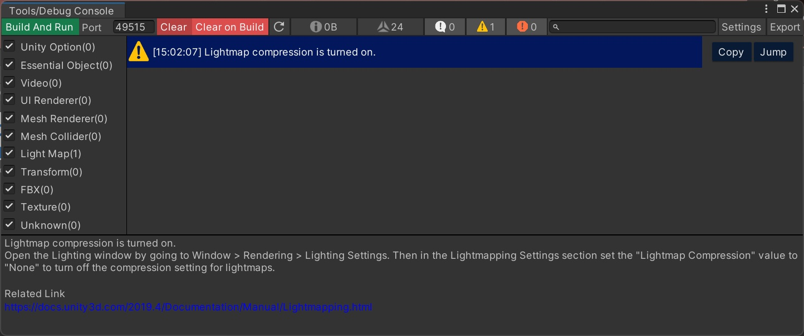
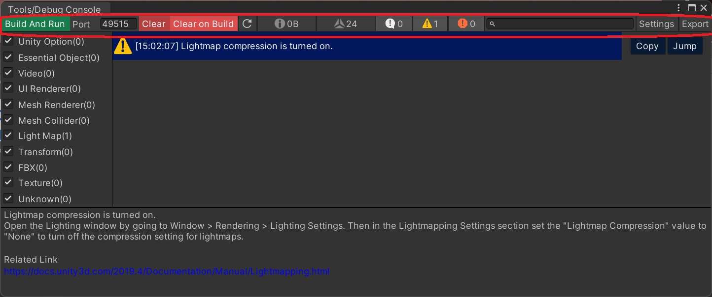
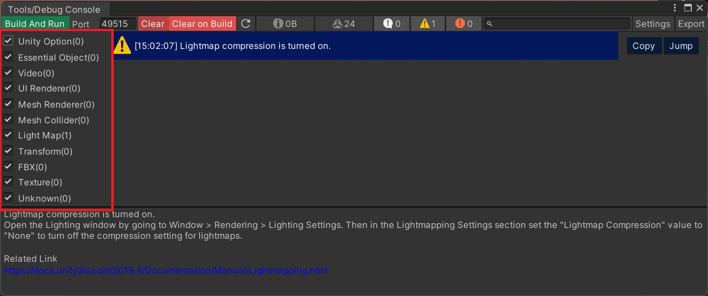

# デバッグコンソールとは

デバッグコンソールは、VketCloudSDKのワールド実装する際のデバッグや問題のトラブルシューティングを補助するためのツールです。主な目的は、実行中のプログラムの状態や挙動に関する情報をリアルタイムに把握することです。

デバッグコンソールの主な機能には以下があります：

1. ログの表示とフィルタリング: デバッグコンソールでは、実行中のアプリケーションから生成されるログメッセージを表示します。ログは種類に応じてフィルタリングできます（例：メッセージ、警告、エラー）。
2. ログの検索: 特定のキーワードやフレーズを含むログを検索できます。これにより、関心のある情報に素早くアクセスできます。
3. ログのコピー: ログメッセージやスタックトレースをクリップボードにコピーできます。これにより、必要な情報を簡単に共有したり、他のツールに貼り付けて分析したりすることができます。
4. ログのエクスポート: ログデータを外部ファイル（例：JSONファイル）としてエクスポートできます。これにより、ログデータを保存したり、別の環境で分析したりすることができます。

デバッグコンソールは、開発者がアプリケーションの実行中に発生するログ情報を監視し、問題の特定やバグの修正に役立ちます。特に複雑なシステムや大規模なプロジェクトの開発においては、デバッグコンソールは非常に重要なツールとなります。

## デバッグコンソールの開き方

VketCloudSDKタブから`ツール`を選択し、`デバッグコンソール`を押下してデバッグコンソールウィンドウを開きます。

## UnityのConsoleとの違いとは

1. VketCloudSDKに特化した表示とフィルタリング、独自エラータイプを実装し、VketCloudSDKでワールド実装する際のデバッグをサポートします。
2. 検索機能の強化: デバッグコンソールでは、ログメッセージの検索機能を提供しています。開発者は特定のキーワードやフレーズを含むログを素早く検索し、関連する情報にアクセスできます。この機能により、大量のログデータの中から必要な情報を見つけやすくなります。
3. ログのコピー機能: デバッグコンソールでは、ログメッセージやスタックトレースを簡単にコピーできます。開発者は必要な情報をクリップボードにコピーして共有したり、他のツールに貼り付けて分析したりすることができます。
4. エクスポート機能: デバッグコンソールでは、ログデータを外部ファイルにエクスポートできます。これにより、開発者はログデータを保存したり、ログを共有しやすくなります。

デバッグコンソールは、Unityのデフォルトのコンソールでは提供されていないカスタマイズ性や高度な機能を備えています。これにより、開発者はより効果的なデバッグと問題解決を行うことができます。

## UI説明

### ツールバーの機能説明

| ラベル | 機能 |
|----|----|
| Build and Run |ワールドのビルドを行い、ローカルでワールドを起動します|
| Port | ワールド起動時のポート番号を入力できます (初期状態では8000番) |
| Clear | ログをすべてクリアします。  なお、解決していない問題は残されます|
| Clear on Build | 毎回「ビルドと実行」をした際に、ログを自動的に消すか消さないかの設定ボタンです |
| テクスチャサイズ（メモリ） | 現在シーン内にアタッチされているテクスチャのメモリ量をリアルタイムで表示します。 これにより、メモリの使用が予想よりも高い場合や、予想外のメモリーを見つけるのに役立ちます。 |
| メッシュポリゴン数 | シーン内のActiveな各メッシュのポリゴン数をリアルタイムで表示し、パフォーマンスへの影響を監視します。 これは、特に複雑なシーンでのパフォーマンス最適化に有用です。  |
| Log | Logを表示するフィルターのオンオフ及びLogの数を表示します |
| Warning | Logを表示するフィルターのオンオフ及びLogの数を表示します |
| Error | Logを表示するフィルターのオンオフ及びLogの数を表示します |
| Search Box | 検索ボックスです |
| Settings | Settingsのウィンドウを開くボタンです。  設定の詳細は以下にあります |
| Export | コンソールログをjsonファイルにエクスポートする機能です |

テクスチャサイズ（メモリ）では以下のコンポーネントにアタッチされたテクスチャーのサイズの合計を表示します。

!!! note "テクスチャサイズで表示されるテクスチャ類"
    -  `Renderer`
    -  `MeshRenderer`
    -  `SkinnedMeshRenderer`
    -  `VKC Item Plane`
    -  `VKC Item Background Texture`
    -  `VKC Setting Nameplate`: NameplateのImageタイプ
    -  `AvatarSetting` のAvatar File
      -  Thumbnail(日本語)
      -  Thumbnail(英語)

また、メッシュポリゴン数では以下のコンポーネントにアタッチされたポリゴン数の合計を表示します。

!!! note "メッシュポリゴン数で表示されるメッシュ類"
    - `MeshRenderer`
    - `SkinnedMeshRenderer`

### デバッグコンソールの設定

デバッグコンソールのツールバーから「設定」を選択し、設定画面のウィンドウを開きます。
本設定ではリソースへの制限値を設定し、各制限値を超えた際にデバッグコンソールにてWarningを生成させられます。

| ラベル | 機能 | 初期値 |
|----|----|----|
| 最大テクスチャサイズ（ピクセル） | 使用するテクスチャのピクセルサイズ上限を2乗単位で設定します。 | 2048*2048 |
| 最大テクスチャサイズ（メモリ） | 使用するテクスチャのメモリサイズ上限を設定します。  | 80 |
| 最大ビデオサイズ（MB） | 使用するビデオファイルのサイズ上限をMB単位で設定します。 | 90 |
| 最大ビデオ尺（秒）| 使用するビデオファイルの長さの上限を秒単位で設定します。 | 90 |

### ログタイプパネル　（左側にあるパネル）

ログタイプパネルは独自のログタイプごとにログをフィルタする機能です。 
各ラジオボタンを押すことでフィルタの切り替えを行います。 
開発での未知なエラー（Compile Error, Runtime Error)は未知カテゴリに格納されます。

### ログエントリーリスト（右側にあるパネル）

ログエントリーリストでは、エラーをリスト表示します。 
リストの各項目をクリックすると、ログの詳細を下のパネルに表示します。 
`コピー`ボタンでログ内容をクリップボードにコピーします。 
`ジャンプ`ボタンで該当のスクリプトやGameObjectがあればそれを開きます。 
また、エラーに関連リンクが設定されている場合はブラウザにて該当のリンクを開きます。

### ログ詳細情報（下のパネル）

以下内容が含まれます。 
(ログによって、関連オブジェクト、関連リンク、関連ログがない場合もあります。)

| ラベル | 機能 |
|----|----|
| `Message` | 選択されたログのメッセージを表示します |
| `StackTrace` | 選択されたログのスタックトレースを表示します |
| `Hint` | 選択されたログのヒント情報を表示します |
| `関連オブジェクト` | 関連するオブジェクトを表示します。  GameObjectを選択するためのフィールドが表示されます |
| `関連リンク` | 関連するリンクを表示し、クリックすると指定されたURLが開かれます |
| `関連ログ` | 関連するログの詳細情報を表示します。  ログのグループ、ログのタイプ、メッセージ、スタックトレースなどが表示されます |

### ログ詳細情報の例

