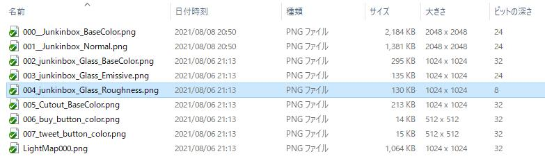

HEOExporterで出力後にテクスチャ圧縮の作業をおこなう必要があります。将来的にはサーバー側で圧縮を行うことができるようにする予定ですが、現在はまだローカルのPC側で圧縮を行う必要があります。テクスチャ圧縮は軽量化にかなり効果があるので必ず実施するようにしてください。


## テクスチャ圧縮の対象
- 2の累乗サイズ（両辺とも、長方形でも可）
- 24bitまたは32bitカラー
- アルベド、ノーマル、エミッション等
- ライトマップ（RGBM/ETC2のみ、ASTCは非対象）
- ReflectionProbe

## 使用ツールのインストール
まず最初に、[PVRTexTool](https://developer.imaginationtech.com/pvrtextool/){target=_blank}をインストールします。
インストールされた PVRTexTool\CLI\Windows_x86_64\PVRTexToolCLI.exe を使用しますので、このフォルダのPATHを通します。（コマンドプロンプトの使い方やPATHの通し方は省略します）

次に [Texconv](https://github.com/Microsoft/DirectXTex/wiki/Texconv){target=_blank}をインストールします。ページを開いてすぐ上の方にある「DOWNLOADS@LATEST」でファイルをインストールことができます。インストールしたtexconv.exeを任意の場所に置き、上記のPVRTexToolと同様にPATHを通してください。

また、HEOファイルに圧縮されたテクスチャの上書きを実行するために、[python](https://www.python.org/downloads/){target=_blank}を導入します。
バージョンは3.11を推奨しますが、それ以外でも動作する想定です。
ただし、python2は動作保証ができないため、その場合は最新のpythonを導入します。

## 圧縮テクスチャファイル作成
HEOExporterでHEOファイルを出力すると、同フォルダに「HEOファイル名_etc2.bat」「HEOファイル名_astc.bat」というバッチファイルが出力されます。中身を見ると、
```
md tex_astc
del tex_astc\*.pvr
PVRTexToolCLI.exe -i tex_sample\000__Junkinbox_BaseColor.png -o tex_astc\000.pvr -m 16 -f ASTC1_4_RGB,UBN,sRGB
PVRTexToolCLI.exe -i tex_sample\001__Junkinbox_Normal.png -o tex_astc\001.pvr -m 16 -f ASTC1_4_RGB,UBN,sRGB
PVRTexToolCLI.exe -i tex_sample\002_junkinbox_Glass_BaseColor.png -o tex_astc\002.pvr -m 16 -f ASTC1_4,UBN,sRGB
PVRTexToolCLI.exe -i tex_sample\003_junkinbox_Glass_Emissive.png -o tex_astc\003.pvr -m 16 -f ASTC1_4_RGB,UBN,sRGB
echo skip tex_sample\004_junkinbox_Glass_Roughness.png
PVRTexToolCLI.exe -i tex_sample\005_Cutout_BaseColor.png -o tex_astc\005.pvr -m 16 -f ASTC1_4,UBN,sRGB
PVRTexToolCLI.exe -i tex_sample\006_buy_button_color.png -o tex_astc\006.pvr -m 16 -f ASTC1_4_RGB,UBN,sRGB
PVRTexToolCLI.exe -i tex_sample\007_tweet_button_color.png -o tex_astc\007.pvr -m 16 -f ASTC1_4_RGB,UBN,sRGB
pause
```
このような内容になっていますが、「echo skip」で始まる行がある場合はそのテクスチャが圧縮対象から外れていることになりますので、念のため内容を確認します。tex_sampleフォルダに画像が入っているので、エクスプローラの詳細で一覧表示します。



「大きさ」と「ビットの深さ」を表示に追加し、大きさが2の累乗でない場合は2の累乗に出来るか確認してみて下さい。ビットの深さも24または32以外の場合は変換出来るか確認してみて下さい。また、4096x4096などの大きなサイズのものが残っていないかどうかも確認して下さい。

修正ができそうな場合はUnityにてテクスチャを修正したものを再度エクスポートしてください。

もう一度バッチファイルの中身を確認し、問題なければこのバッチファイルをダブルクリックして実行します。すると「tex_etc」「tex_astc」というフォルダが作成され、「tex_sample」フォルダ内にあるテクスチャを読み込んで圧縮変換されたファイルがその中に作成されます。

※リフレクションプローブを使用する場合、追加で「tex_reflection_cube_etc」「tex_reflection_cube_astc」というフォルダが作成されます。

!!! note caution
    Windowsのユーザ名に2バイト文字（日本語など）が含まれている場合かつ、
    echo skipで始まる行がある場合正しくバッチ処理が行われない可能性があります。
    画像ファイルを上記に従い修正するか、バッチファイルをメモ帳などで編集し該当の行を削除してください。

## HEOファイル上書き

VketCloudSDKに含まれる
`Packages/com.hikky.vketcloudsdk/PackageResources/tools/HEOTexComp_Python/HEOTexComp.py`を使用します。

圧縮したいテクスチャを持つHEOと同じディレクトリに`HEOTexComp.py`をコピーするか、`HEOTexComp.py`が入っているディレクトリに直接入った上でコマンドプロンプトを開き、

``````
python HEOTexComp.py [HEOファイルのあるフォルダパス]\[HEOファイル名].heo
``````

と実行すると、

``````
ExistCubemapTextureCompression 10 10 10 10

ExistTextureCompression 5 5 5 5
Succeeded
``````

などと表示されます。「Succeeded」と最後に表示されていれば成功です。その直前の数字はPVRTC/ETC/ASTC/DXTのファイル数です。

これによりHEOファイル内に圧縮テクスチャが存在するかどうかのフラグが書き込まれます。

!!! note
    バージョンアップによってpvrtc変換及びdxt変換が廃止されたため、以下のようにHEOTexCompの結果で先頭及び末尾が０になりますが、こちらは正常な挙動です。<br>
    旧SDKバージョンのプロジェクトからファイルを移植した際に同変換のバッチファイルが混ざる場合がありますが、削除した上でテクスチャ圧縮を行っても問題ございません。

    ExistTextureCompression 0 5 5 0

!!! note
    ごく稀にWindows向けのDXT変換で見た目の色合いが変になる場合があります。<br>
    該当の現象が発生する場合はDXT変換を使用しなくても問題ございません。