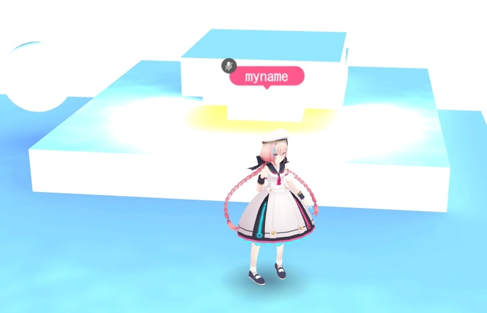
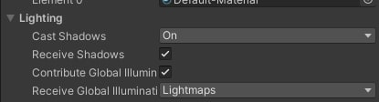
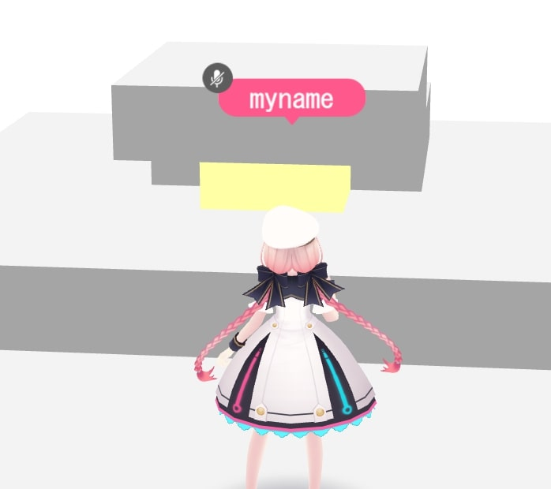
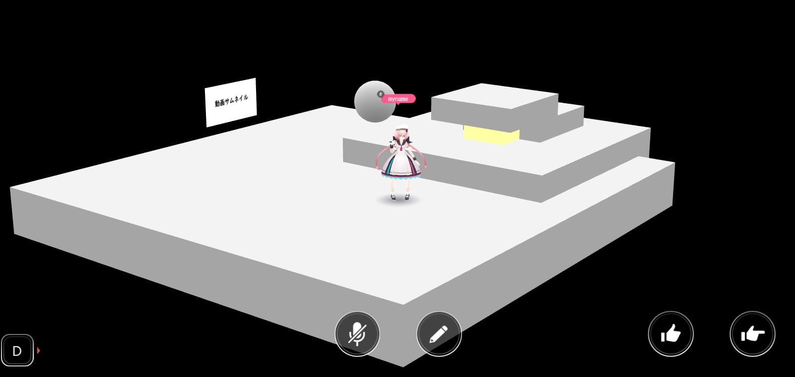

# Unity settings for replicating actual appearance in Vket Cloud

## Overview

Depending on the lighting settings in Unity, the appearance in Unity and the appearance after building the Vket Cloud scene may differ.
This page describes how to prevent this phenomenon from occurring.

!!! info
    SDK Version: 4.1.4 
    OS: Windows 10 
    Unity: 2019.4.31.f1 
    Browser: Google Chrome

## Method

## ① Check Global Illumination

Vket Cloud does not support real-time global illumination, so please express it with lightmaps.

[Unity Production Guidelines/Lightmaps](../WorldMakingGuide/UnityGuidelines.md#_6) (If the appearance differs between Unity and Vket Cloud, it is mostly due to issues around GI)

| Global Illumination Settings in Unity | Screen after Vket Cloud Build |
| ---- | ---- |
|  |  |

!!! info "About Global Illumination"
    When creating a lightmap with materials that have Emission set and Mesh Renderer with Contribute Global Illumination checked, global illumination can be created as shown on the left above. 
    In Vket Cloud, Contribute Global Illumination tends to cause malfunctions, so avoid using it.

| Global Illumination Not Set in Unity | Not Set in Vket Cloud |
| ---- | ---- |
|  |  |

When there is no global illumination, there is no difference between Unity and Vket Cloud. 
A common issue is that even though it is set to *Unlit/Texture, it is affected by the lightmap and becomes dark*.

## ② Set Skybox to None

When lighting with a Skybox set, the color of the Skybox will be reflected even if the Contribute Global Illumination setting of each object is set to false.

Even if it is bright yellow on the Unity screen as shown in the image above...

The scene after the build will look like this. The Skybox has no effect. 
Since Skybox cannot be used in Vket Cloud, if there is an unnecessary Skybox, set it to None or Default-Skybox.

## ③ Change Standard Shader Settings

The physically-based rendering of Vket Cloud uses the same algorithm (GGX) as Unity's Medium level, so the settings need to be aligned.

1. Open "Edit/ProjectSettings/Graphics"

    

    

2. Uncheck "Use Defaults" for Low, Medium, and High in "Tier Settings"

    

3. Change "Standard Shader Quality" to "Medium" for Low, Medium, and High in "Tier Settings"

    

##  Ensure that the lightmap format suitable for the platform is set

As stated in [Unity Production Guidelines/Lightmaps](../WorldMakingGuide/UnityGuidelines.md#_6), the appropriate lightmap format differs for PC and Android, and incorrect settings can cause overexposure.

Platform: When the lightmap format for Android is set on PC

## Ensure that the color space is set to linear

Open "Edit/Project Settings/Player/Other Settings" and ensure that Color Space is set to "Linear"

 
| Before Setting | After Setting |
| ---- | ---- |
|  |  |
