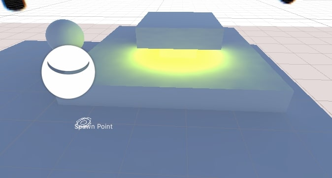
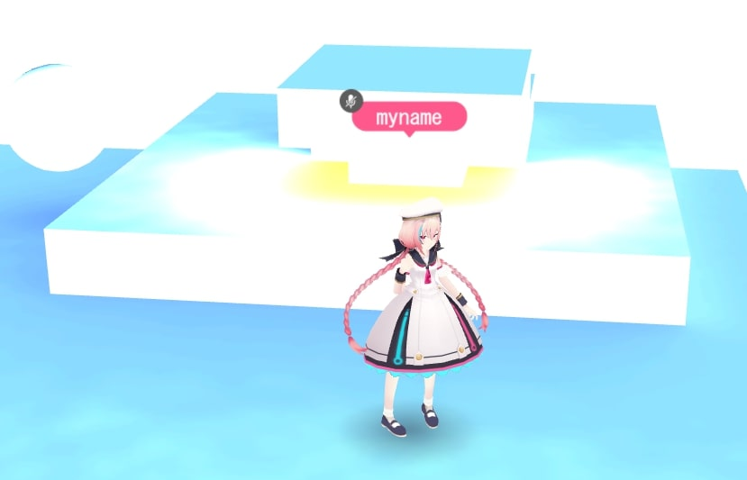
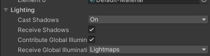
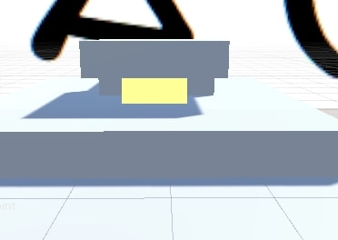
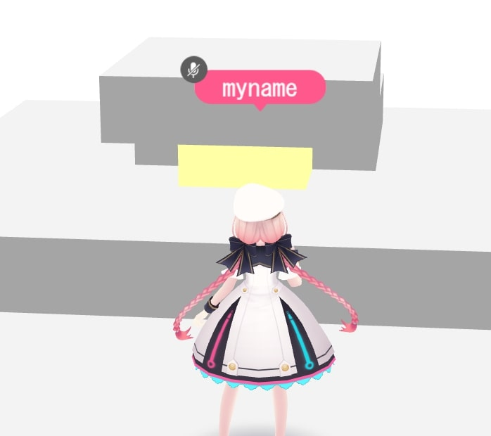
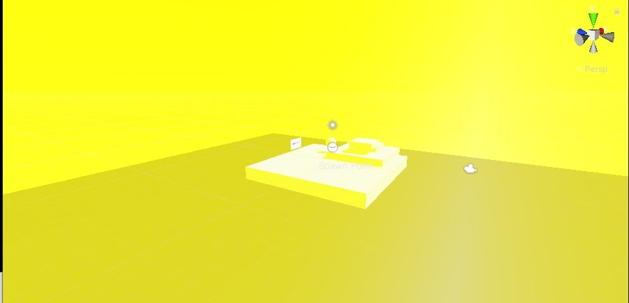
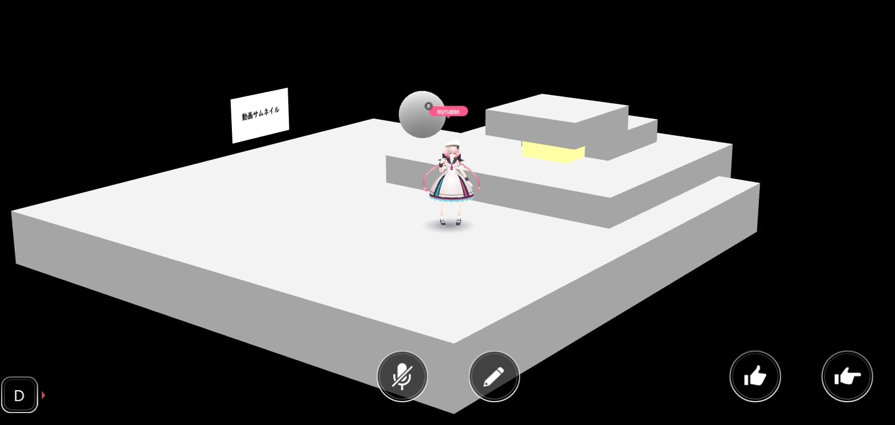
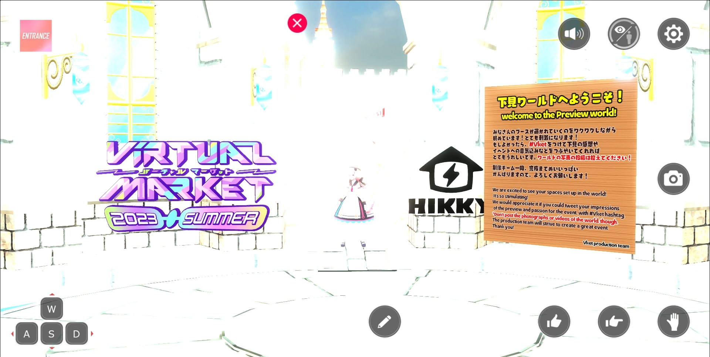
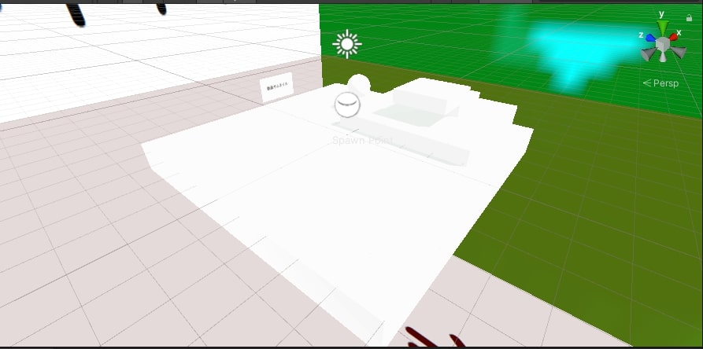
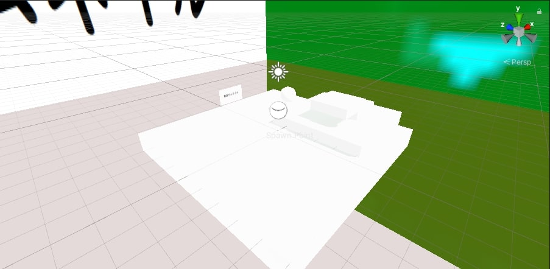

# UnityとVket Cloudの見た目を揃える

## 概要

Unityのライティング設定によっては、Unityの見た目と、Vket Cloudシーンビルド後の見た目が異なることがあります。
本ページではその現象を発生しなくする方法について記載します。

!!! info
    SDKバージョン : 4.1.4 
    OS : Windows 10 
    Unity : 2019.4.31.f1 
    ブラウザ : Google Chrome

## 方法

## ①グローバルイルミネーションの確認

Vket Cloudではリアルタイムのグローバルイルミネーションをサポートしていないので、そちらはライトマップで表現してください。

[Unity制作ガイドライン/ライトマップ](../WorldMakingGuide/UnityGuidelines.md#_6) (UnityとVket Cloudで見た目が違う場合、ほとんどはGI周りが原因だと思います)

| Unity上のグローバルイルミネーション設定 | Vket Cloudビルド後の画面 |
| ---- | ---- |
|  |  |

!!! info "グローバルイルミネーションについて"
    Emissionを設定しているマテリアルと、Mesh RendererのContribute Global Illuminationにチェックが付いた状態でライトマップを作成すると、上記左のように、グローバルイルミネーションが作成できます。 
    Vket Cloudでは誤作動の原因になりがちなので、Contribute Global Illuminationは使用しないようにしましょう。

| グローバルイルミネーション未設定＠Unity | 未設定＠Vket Cloud |
| ---- | ---- |
|  |  |

グローバルイルミネーションが無い時は、Unity・Vket Cloudで差異が生じません。 
特に多いのが、*Unlit/Textureに設定しているにもかかわらず、ライトマップの影響を受け、黒ずむ*というパターンです。

## ②SkyboxをNoneにする

Skyboxを設定した状態でライティングを行うと、各オブジェクトがContribute Global Illuminationの設定をfalseにしていても、Skyboxの色味が反映されてしまいます。

上記画像のように、Unity画面上では真っ黄色になっていても…

ビルド後のシーンはこの通り。Skyboxの影響は一切受け付けません。 
Vket CloudではSkyboxは使用できないため、不要なSkyboxが入っている場合、None或いはDefault-Skyboxにしましょう。

## ③StandardShaderの設定を変更する

Vket Cloudの物理ベースレンダリングは、UnityのMediumレベルのものと同じアルゴリズム(GGX)を使用しているので、設定を揃える必要があります。

1. 「Edit/ProjectSettings/Graphics」を開く

    

    

2. 「Tier Settings」のLow、Medium、Highそれぞれの「Use Defaults」のチェックを外す

    

3. 「Tier Settings」のLow、Medium、Highそれぞれの「Standard Shader Quality」をすべて「Medium」に変更する

    

##  プラットフォームに適したライトマップフォーマットが設定されていることを確認する

[Unity制作ガイドライン/ライトマップ](../WorldMakingGuide/UnityGuidelines.md#_6) にあるように、PCとAndroidで適切なライトマップフォーマットが異なり、設定を間違えていると、白飛びが発生してしまいます。

プラットフォーム : PCでAndroid向けのライトマップフォーマットの設定を行っていた場合

## カラースペースがリニアになっていることを確認する

「Edit/Project Settings/Player/Other Settings」を開き、Color Spaceが「Linear」になっていることを確認する

 
| 設定前 | 設定後 |
| ---- | ---- |
|  |  |
