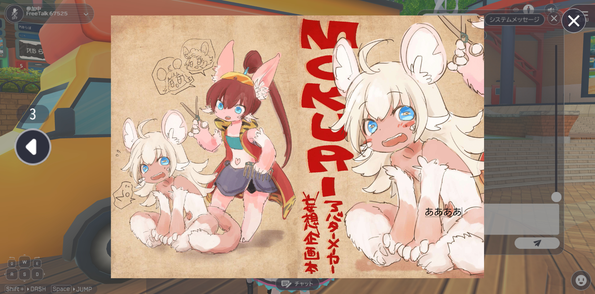
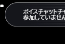

# ActivityCanvas実装時、既存UI・入力欄の消し方

Activityで新規に実装したUIを表示する際、既存のUIを一時的に非表示にしたい場面があるかと思います。
また、UIを非表示にしても残り続けるテキストチャットやボイスチャットチャンネル名などの入力欄は残り続けてしまいます。
本記事では、これらの削除方法について紹介します。



!!! info
    SDKバージョン : 14.1.2<br>
    OS : Windows10<br>
    Unity : 2019.3.6f1<br>
    ブラウザ :Google Chrome<br>

## 既存UIの消し方

hsCanvasSuspendVisibleLayers() を、既存UIを非表示にしたいタイミングで実行するだけです。 非表示にした既存UIを元に戻す場合は、hsCanvasResumeVisibleLayers() を使います。

2つのメソッドはLib14以降で登場したメソッドなので、Lib13以前では使うことが出来ません。
また、このメソッドを使用しても入力欄の文字は消すことが出来ません。

## 入力欄の消し方
Vket CloudのHUD上のUIには、

- テキストチャット入力欄
- ボイスチャットチャンネル名入力欄

の2つの入力欄があります。
(Menuを含めると、プレイヤー名の変更入力欄もあります)

入力欄を非表示にするためには、HTML要素を非表示にする必要があります。
ActivityのGUIを非表示にした際、原状復帰のため再表示する必要があります。

ただし、ボイスチャットチャンネルの入力欄はもともと表示されていたかどうかよって処理を分岐させる必要があります。
(もともと表示されていないのに表示状態にしようとすると画面左上に入力欄が表示されてしまいます。)



入力欄。小さいが表示される。

HTML要素の非表示にはJavaScriptの機能hel_set_HTMLElement_visibility(string elementName, bool visibility)を使います。

## コーディング例

ActivityのGUIを表示する際、既存のUI+入力欄を消し、ActivityのGUIを非表示にする時、元の状態に復帰するコーディングの例です。

```
// HTML要素の表示を切り替えるJavaScript機能
extern{
    void hel_set_HTMLElement_visibility(string elementName, bool visibility);
}

// ボイスチャットチャンネルの入力欄が表示されているかどうか
bool _isChannelCreateShow;

// 入力欄のHTML要素・ボイスチャットチャンネルの入力欄のあるレイヤーの名称
const string _TextchatElementName = "textchat-text";
const string _ChannelnameElementName = "channelname-text";
const string _ChannnelCreateLayerName = "vcc_setting_channel_window";

private LayerBundle _channelCreateLayer;

_channelCreateLayer = hsLayerGet(_ChannnelCreateLayerName);

// アクティビティによるGUIを表示する際に必要な処理
void ActivityGUIShow(){
  // ボイスチャットチャンネルの入力欄の表示状況を確認
  _isChannelCreateShow = _channelCreateLayer.IsShow();
  
  // 既存UIの非表示化
  hsCanvasSuspendVisibleLayers();
  
  // 入力欄の非表示
  hel_set_HTMLElement_visibility(_TextchatElementName,false);
  hel_set_HTMLElement_visibility(_ChannelnameElementName,false);
}

// アクティビティによるGUIを非表示にする際に必要な処理
void ActivityGUIHide(){
  // 既存UIの表示
  hsCanvasResumeVisibleLayers();

  // 入力欄の表示(ボイスチャットチャンネルの入力欄は非表示命令実行時の表示状況を参照する)
  hel_set_HTMLElement_visibility(_TextchatElementName,true);
  hel_set_HTMLElement_visibility(_ChannelnameElementName,_isChannelCreateShow);
}
```

## 注意点
ボイスチャットチャンネルの入力欄の表示状況を確認で使用するIsShow()はCanvas内のHeliScriptだと正常に動作しません。

```
Activity
├ Canvas
│├ HeliScript
││└ VCCChannelIsShow.hs × NG
│├ landscape
│└ portrait
└ HeliScript
　└ VCCChannelIsShow.hs ○ OK
```
必ず、ActivityHeliScript内で行いましょう。
