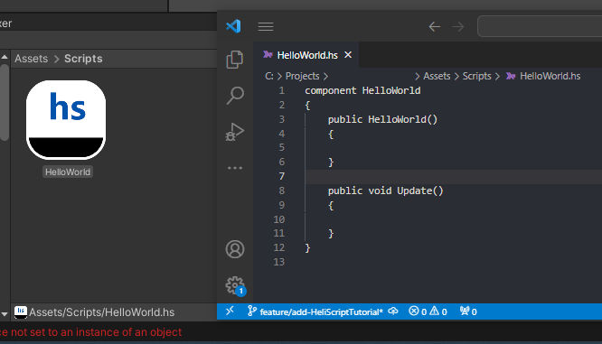

# HeliScript概要

Vket Cloudでは、HeliScriptというエンジン独自のプログラミング言語を使用してプログラミングを行うことができます。<br>
HeliScriptを使用すると、[アクション](../Actions/ActionsOverview.md)と比べてより複雑なギミック・挙動を実装できます。

HeliScriptの文法については[基本系](./hs_var.md)から順番に読むことで習得できます。<br>
また、ここでは以下にてHello Worldを出力する方法を通じて、基本的な実装の例を示します。

## IDEについて
推奨のIDEはVisual Studio Codeです。Visual Studio Codeは軽量で高機能なエディタであり、HeliScriptの文法に対応しています。<br>
Visual Studio Codeのインストール方法は[こちら](https://code.visualstudio.com/){target=_blank}からダウンロードしてください。

非推奨のIDEはVisual Studioです。Visual Studioを使用してUnityプロジェクト内にVket Cloud SDKが作成したHeliScriptファイルを開き、編集を保存すると、エンコードがANSIに変換されてビルドが出来なくなってしまう場合があります。

## HeliScriptの使い方の例 (Hello Worldをコンソールに出力する)

### 1. AssetsにHeliScriptファイルを追加する


初めに、HeliScriptを書き込むファイルを作ります。<br>
Projectウィンドウ(Assetsなどがあるところ)で右クリックして、**「HeliScript」**を選択し、任意のフォルダにHeliScriptファイルを追加します。

例として、ここではAssetsフォルダにScriptsフォルダを追加し、HelloWorld.hsという名前でHeliScriptファイルを新規生成しています。



### 2. VKC Attribute Scriptをシーンに追加する


HeliScriptファイルを追加したら、次はシーンにHeliScriptの設定を行います。<pr>
HeliScriptは[VKC Attribute Script](../VKCComponents/VKCAttributeScript.md)コンポーネントを使用してシーン内に登場させます。
Inspector画面にてAdd Component > VKC Attribute Scriptと選択してコンポーネントのアタッチを行います。

[VKC Attribute Script](../VKCComponents/VKCAttributeScript.md)コンポーネントでは実行したいHeliScriptファイルを選びます。<br>
メニュー右の「Select」を選択するとHeliScriptの一覧が出現するため、使いたいHeliScriptを選択します。

### 3. VketCloudSettings / BasicSettingsにてデバッグモードを有効にする


今回実装するHelloWorldでは、デバッグログにて文字を出力するためにワールドのビルドをデバッグモードに設定する必要があります。<br>
デバッグモードを使うためにVketCloudSettings / [BasicSettings](../VketCloudSettings/BasicSettings.md)の[Debug Mode](../WorldEditingTips/DebugMode.md)を有効にします。

### 4. HeliScriptを書く

いよいよHeliScript本体を書いていきます。<br>
HelloWorld.hsの実装として以下に例を示します。

```C#
//コンポーネント
component HelloWorld
{   

    //コンストラクタ関数：ワールド入場時に一度だけ実行されます
    public HelloWorld()
    {
    //デバッグログに出力
    hsSystemWriteLine("Hello, World!");
    }

    //アップデート関数：毎フレーム実行されます
    public void Update()
    {

    }
}
```

### 5. Build And Runでテストする

コードの実装を完了した上で、Build And Runを実行すると画面上のデバッグログに"Hello, World!"が出力されます。


!!! warning "エラーが起きた場合は"
    HeliScriptがワールドロード中あるいは呼び出しによって実行された際にエラーが起きた場合はデバッグログとブラウザのコンソールに表示されます。<br>
    初期状態ではデバッグログは非表示になっているため、表示するには[デバッグモード](../WorldEditingTips/DebugMode.md)を有効にしてください。<br>
    なお、ワールドロード時にデバッグログは非表示になるため、ロードが停止した際は[ブラウザのコンソール](../troubleshooting/BuildError.md#_4)をご確認ください。


## VKC Attribute Scriptの配置・オブジェクトの参照について

[VKC Attribute Script](../VKCComponents/VKCAttributeScript.md)をアタッチ可能なGameObjectは、スクリプトの対象となる[VKC Item Field](../VKCComponents/VKCItemField.md)がアタッチされているオブジェクト及びその子オブジェクトです。<br>
詳しいHeliScriptの配置方法は[VKC Attribute Script](../VKCComponents/VKCAttributeScript.md)をご確認ください。


HeliScript内で各オブジェクトを参照する際は、後述するItem及びNodeによって取り扱います。<br>
例として、以下のように[VKC Item Field](../VKCComponents/VKCItemField.md)下のexampleObjectがクリックされた際にメッセージを出力するスクリプトが書けます。

```C#
component example
{
    //ItemとPlayerを定義
    //ここではhsItemGetなどの取得関数を含め、オブジェクトの初期化はできないためにご注意ください
	Item	ex_Item;
	Player	ex_player;

    bool    ex_isPlayerInit; //Playerクラス初期化管理
	int		ex_ItemNodeIndex;

    public example()
    {
        //Itemを認識　Item名は.heoになっている物を指定する　今回はVKC Item Field指定
        ex_Item = hsItemGet("World");

        ex_isPlayerInit = false;
        
        //ItemがVKC Item Fieldなので、その傘下にあるオブジェクトのノードを取得可能
        ex_ItemNodeIndex = ex_Item.GetNodeIndexByName("exampleObject");
    }

    public void update()
    {
        //Playerのインスタンス取得がまだの場合、一度だけhsPlayerGet()を実行する
        if(!ex_isPlayerInit){
        //Playerを認識・取得
        ex_player = hsPlayerGet();
        ex_isPlayerInit = true;
        }
    }

    //クリックしたとき、対象のノードを取得する。OnClickNodeの使い方はコールバック関数のページをご参照ください
    public void OnClickNode(int NodeIndex)
    {
        //クリック対象と上で取得したノードが一致したとき
    	if(NodeIndex == ex_ItemNodeIndex){
    	    //メッセージを表示
        	hsSystemWriteLine("exObj Clicked.");
        }
    }
}
```

!!! warning "Playerオブジェクトの初期化について"
    SDK Ver12.x以降より、Playerクラスの関数はコンストラクタでの呼び出しができなくなりました。<br>
    インスタンスの取得を行いたい際は、例として上記のようにフラグとなるbool変数を用意してコンストラクタ以外の関数にて呼び出してください。

スクリプトを[VKCAttributeScript](../VKCComponents/VKCAttributeScript.md)に設定し、ワールドをビルドすると以下のようにオブジェクトをクリックした際にメッセージが出力されます。


OnClickNodeなど、SDKに用意されているコールバック関数は[コンポーネント / コールバック関数](./hs_component.md)をご参照ください。

## Player / Item / Nodeについて

Vket Cloud独自の概念として、Player, Item, そしてNodeがあります。<br>
以下にて各概念の概要を解説します。

## Player

Vket Cloudにおいて、Playerはワールド内の操作主体である自身を指します。<br>
Playerの振る舞い方は[VKC Setting Player](../VketCloudSettings/PlayerSettings.md)で定義されます。

PlayerのHeliScriptでの取り扱いは[Playerクラス](./hs_class_player.md)をご参照ください。

## Item

Vket Cloud上でワールドを構成する際、Player以外の各要素はItemとして表現されます。<br>
[VKC Item Field](../VKCComponents/VKCItemField.md), [VKC Item Object](../VKCComponents/VKCItemObject.md), [VKC Item Plane](../VKCComponents/VKCItemPlane.md), [VKC Item Activity](../VKCComponents/VKCItemActivity.md)などがこれにあたります。

ItemのHeliScriptでの取り扱いは[Itemクラス](./hs_class_item.md)をご参照ください。

## Node

前述のItemのうち、[VKC Item Field](../VKCComponents/VKCItemField.md)で定義されたItemに子オブジェクトがある場合、その子オブジェクトはItemのNodeとして扱われます。<br>
例として、以下の[VKC Item Field](../VKCComponents/VKCItemField.md)に取り付けられたObjectA, ObjectB, ObjectC, ObjectC2, ObjectC3はNodeとなり、[Show/HideNode](../Actions/Node/ShowHideNode.md), [Enable/DisableCollider](../Actions/Node/EnableDisableCollider.md)などのアクションの対象となります。<br>

なお、[VKC Item Field](../VKCComponents/VKCItemField.md)の子オブジェクトになっていない`ObjectD`はNodeではなく、かつItemでもない場合はビルド時にワールドに含まれないことに注意してください。


また、各Nodeは階層構造を持たない点にご留意ください。<br>
例えば、複数のGameObjectを[Show/HideNode](../Actions/Node/ShowHideNode.md)からまとめて非表示にしたい場合、Unity上で親子構造を持った親側のGameObjectをTargetに指定して非表示にしたとしても、アクション / HeliScript上ではUnityのHierarchy上の親子構造が無視されるため、配下の子GameObjectも同時にまとめて非表示にするようなことはできません。<br>
そのため、非表示にしたいGameObject / Nodeを対象の数だけ個別に指定する必要がございます。

NodeのHeliScriptでの取り扱いは[Itemクラス](./hs_class_item.md)をご参照ください。
