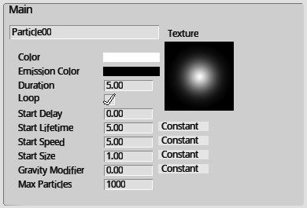
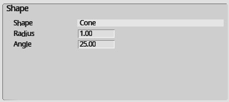
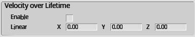
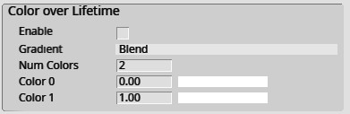
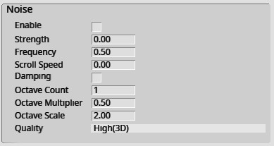

# パーティクルエディター：プロパティ一覧

パーティクルエディターでは、以下の設定の編集によって様々なパーティクル表現を作ることができます。

## Transform

| 名称 | 初期値 | 機能 |
| ---- | ---- | ---- |
| Position | 0,0,0 | パーティクルの生成位置 |
| Rotation | -90,0,0 | パーティクルの生成角度 |
| Scale | 1,1,1 | パーティクルの大きさ |

## Main

| 名称 | 初期値 | 機能 |
| ---- | ---- | ---- |
| Name | Particle00 | パーティクル名 |
| Texture |  | パーティクルのベースとなる画像 |
| Color | RGBA(255,255,255,255) | パーティクルのベース色 |
| Emission Color | RGBA(0,0,0,0) | パーティクルの発光色 |
| Duration | 5.00 | パーティクルの寿命（秒単位） |
| Loop | True | パーティクルの寿命が過ぎた後に再生成（ループ）するか設定します |
| Start Delay | 0.00 | パーティクルの生成開始までの待ち時間（秒単位） |
| Start Lifetime | 5.00 | パーティクル生成時の寿命（秒単位） |
| Start Speed | 5.00 | パーティクル生成時の速度(m/s単位) |
| Start Size | 1.00 | パーティクル生成時の大きさ |
| Start Color | RGBA(255,255,255,255) | パーティクルの生成時の色 |
| Gravity Modifier | 0.00 | パーティクルにかかる重力の値 |
| Max Particles | 1000 | パーティクルが放出される最大の数 |

!!! note "パーティクルの色について"
    パーティクルの色は以下のように決定されます： 
    Color + Emission Color (加算) * Start Color (乗算) 
    なお、[Color over Lifetime](#color-over-lifetime)が有効の際は本設定に従わないためご注意ください。

!!! note "Constant / Rand Twoについて"
    数値設定におけるConstant / Rand Twoは以下のように定義されます。 
    Constant:　固定値  Rand Two: 設定した二つの値の間をランダムに移行する

## Emission

| 名称 | 初期値 | 機能 |
| ---- | ---- | ---- |
| Rate Over Time | 10.00 | 1秒あたりのパーティクル生成数 |
| Rate Over Distance | 0.00 | パーティクル座標の移動率に応じて生成されるパーティクル数の変化値 |

!!! bug "Rate Over Distance"
    Rate Over DistanceについてはVer9.11現在設定が反映されない状態を確認しております。 
    恐れ入りますが、修正までお待ちいただければと思います。

## Shape

| 名称 | 初期値 | 機能 |
| ---- | ---- | ---- |
| Shape | Cone | パーティクルが放出される軌道 Sphere: 球形 Cone: 円錐形 Circle: 円形 Hemisphere: 半球形 |
| Angle | 25.00 | パーティクルの放出軌道の角度 |
| Radius | 1.00 | パーティクルの放出軌道の半径 |
| Radius Thickness | 1.00 | パーティクルの放出体積の比率。  0.00: 軌道の外面からの放出 1.00: 軌道全体から放出 |
| Arc | 360.00 | 放出の円弧の角度を設定します |
| Arc Mode | Random | 円弧の周りでのパーティクルの生成方法を設定します。  Random:円弧の周囲にランダム生成 Loop:円弧の周囲にて順番に生成 |
| Arc Speed | 1.00 | 放出位置が円弧の周囲を移動する速度を設定します |

## Velocity over Lifetime

| 名称 | 初期値 | 機能 |
| ---- | ---- | ---- |
| Enable | false | 本機能のオンオフ |
| Linear | 0,0,0 | パーティクル放出中の速度が値に沿って変化します |
| Orbital | 0,0,0 | パーティクル放出中の環状の加速度が値に沿って変化します |
| Offset | 0,0,0 | 環状パーティクルの中心位置が変化します |

!!! bug "Orbital, Offsetについて"
    本値は現在未使用のパラメーターです。

## Limit Velocity over Lifetime

| 名称 | 初期値 | 機能 |
| ---- | ---- | ---- |
| Enable | false | 本機能のオンオフ |
| Separate Axis | false | 設定をする際に軸をX,Y,Zに分けます |
| Speed | 0,0,0 | パーティクルが設定値以上の速度にならないように設定できます |
| Damp | 0.00 | パーティクルの速度が上限速度を超えた際の減衰量を設定します |
| Drag | 0.00 | パーティクルの速度の減衰を設定します |
| Multiply by Size | false | パーティクルの大きさが大きいほど、減衰が大きくなるように設定します |
| Multiply by Velocity | false | パーティクルの速度が早いほど、より減衰の影響が大きくなるように設定します |

!!! bug "Drag"
    本値は現在未使用のパラメーターです。

## Size over Lifetime

| 名称 | 初期値 | 機能 |
| ---- | ---- | ---- |
| Enable | false | 本機能のオンオフ |
| Separate Axis | false | 設定をする際に軸をX,Y,Zに分けます |
| Size | 0.00 | 時間経過による大きさの変化値を設定します |
| Curve Mode | Constant | 大きさの変化の仕方を設定します。  Constant: 固定値分サイズが変化 Two Constants: 最小値-->最大値までイージングに沿って変化 |
| Easing Type | Linear | イージングの種類を設定します。|

## Color over Lifetime

| 名称 | 初期値 | 機能 |
| ---- | ---- | ---- |
| Enable | false | 本機能のオンオフ |
| Gradient | Blend | 時間経過によって設定した色に混ざるかに否かを設定します。   Blend: Color0,1が混ざったあとColor1に変化する  Fixed:Color0,1が混ざらずにColor1に変化する |
| Num Colors | 2 | 経過する色の数を設定します |
| Color0 | 0.00 , RGBA(255,255,255,255) | パーティクル生成後に何秒に色が変化するか設定します |
| Color1 | 1.00 , RGBA(255,255,255,255) | 同上 |

## Rotation over Lifetime

| 名称 | 初期値 | 機能 |
| ---- | ---- | ---- |
| Enable | false | 本機能のオンオフ |
| Curve Mode | Constant | 回転値の変化の仕方を設定します。  Constant: 固定値分サイズが変化 Two Constants: 最小値-->最大値までイージングに沿って変化 |
| Velocity | 0,0,0 | 時間経過による回転値の変化を設定します。 |
| Easing Type | Linear | イージングの種類を設定します。|

## Noise

| 名称 | 初期値 | 機能 |
| ---- | ---- | ---- |
| Enable | false | 本機能のオンオフ |
| Strength | 0.00 | ノイズ強度（ノイズ影響時の速度の変化値）を設定します |
| Frequency | 0.50 | パーティクル放出時の方向と素早さが変化する頻度を設定します |
| Scroll Speed | 0.00 | ノイズ発生時の不規則さを設定します |
| Damping | false | StrengthがFrequencyに比例するように設定します |
| Octave Count | 1.00 | ノイズのレイヤー数を設定します |
| Octave Multiplier | 0.50 | ノイズのレイヤー数に応じた強度減少量を設定します |
| Octave Scale | 2.00 | ノイズのレイヤー数に応じた周波数減少量を設定します |
| Quality | High(3D) | ノイズの品質をLow(1D),Medium(2D),High(3D)から設定します |

## Sub Emitters

| 名称 | 初期値 | 機能 |
| ---- | ---- | ---- |
| Enable | false | 本機能のオンオフ |
| Particle Index | 0 | 指定した番号のパーティクルを生成します |
| Type | Birth | サブパーティクル生成の判定を主パーティクルのBirth(生成時)またはDeath(消滅時)に設定します |
| Probability | 0.00 | サブパーティクル生成の判定の発生割合を設定します |

## Texture Sheet Animation

| 名称 | 初期値 | 機能 |
| ---- | ---- | ---- |
| Tiles | 0,0 | テクスチャを分割して作るタイル数を変更します |

## Trail

| 名称 | 初期値 | 機能 |
| ---- | ---- | ---- |
| Enable | false | トレイル機能(トレイルエフェクト)のオンオフを設定します |

!!! bug "本機能について"
    本機能はVer9.11現在設定できない状態が確認されております。

## Render Setting

| 名称 | 初期値 | 機能 |
| ---- | ---- | ---- |
| Render Mode | Billboard | パーティクルの表示方向を設定します  Billboard: 常にカメラ方向を向きます Stretched: カメラの方向を向き、大きさの変更が適用されます |
| Speed Scale | 0.00 | 速度に比例して大きさを変更します |
| Length Scale | 0.00 | 大きさを横向きに変更します |
| Render Alignment | View | パーティクルの整列方法を設定します。  View: カメラの平面に対して整列 Local: ゲームオブジェクトのTransformコンポーネントに対して整列 Velocity: パーティクルの進行方向に対して整列 |

### Easing Typeについて

| 名称 | 機能 |
| ---- | ---- |
| Linear | 線形 |
| EaseInSine | |
| EaseInSine | |
| EaseInOutCubic | |
| EaseInQuart | |
| EaseOutQuart | |
| EaseInOutQuart | |
| EaseInQuint | |
| EaseOutQuint | |
| EaseInOutQuint | |
| EaseInExpo | |
| EaseOutExpo | |
| EaseInOutExpo | |
| EaseInCirc | |
| EaseOutCirc | |
| EaseInOutCirc | |
| EaseInBack | |
| EaseOutBack | |
| EaseInOutBack | |
| EaseInElastic | |
| EaseOutElastic | |
| EaseInOutElastic | |
| EaseInBounce | |
| EaseOutBounce | |
