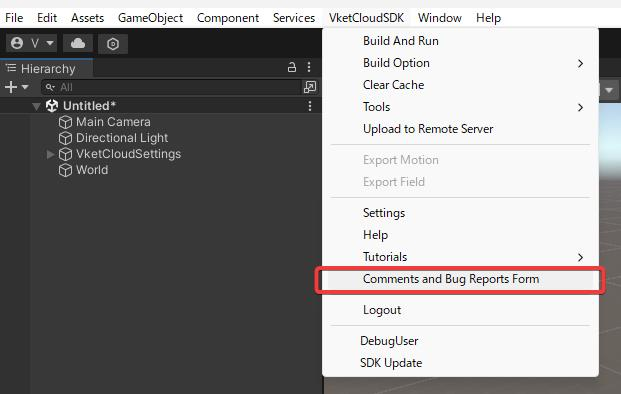
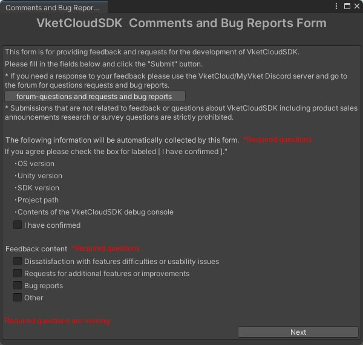

# Comment and Bug Reports Form

This feature allows you to directly send feedback, requests, and bug reports about the VketCloud SDK from the Unity editor.
It provides a way to easily and anonymously share any inconveniences you experience while using the VketCloud SDK, as well as any bugs you discover during development.
We encourage you to share your thoughts with us.

If you would like a direct response or support from staff, please contact us on [VketCloud/MyVket Discord](https://discord.com/invite/vsFDNTKdNZ){target=_blank}

1. Select Vket Cloud SDK > Comments and Bug Report Form from the Unity Editor.

2. The form window will open, so please enter the necessary information as instructed and click 'Next'.

3. You can enter up to 5000 characters of free text and optionally attach one image. Click 'Submit' to submit your comment / bug report.

!!! note "If you need a response or support"
    Please note that this form is intended for easily sending feedback and is not meant for support purposes. 
    Therefore, if you would like a response or support, we kindly ask that you use the official Discord. 
    [VketCloud/MyVket Discord](https://discord.com/invite/vsFDNTKdNZ){target=_blank}
