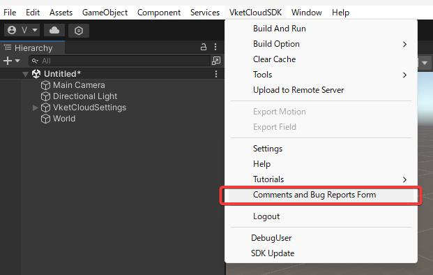
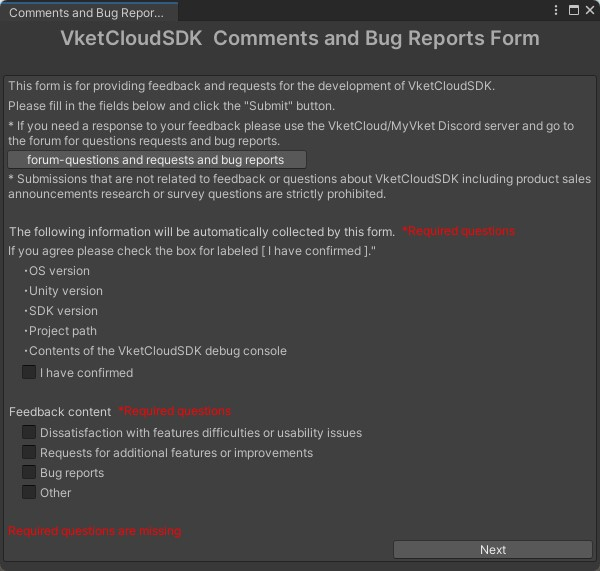
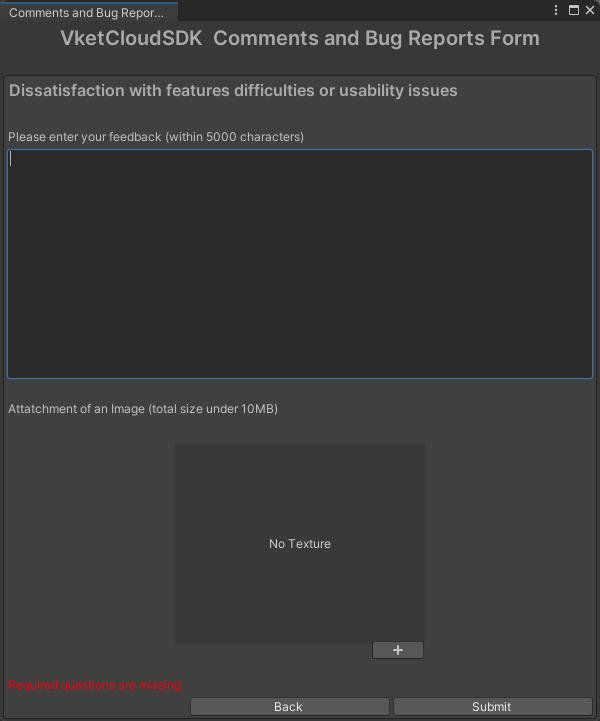

# ご意見・バグ報告フォーム

ご意見・バグ報告フォームは、Unityエディター上から直接、VketCloud SDKについての意見や要望、バグレポートを送信できる機能です。
本機能はVketCloud SDKを使用する上で少しでも不便に感じた点への意見や、制作中に発見したバグを気軽に匿名で送信できる仕組みとなっています。
ぜひお気軽にお声をお聞かせください。
もし、運営からの返答やサポートをご希望される場合は、[VketCloud/MyVket Discord](https://discord.com/invite/vsFDNTKdNZ){target=_blank}にてお問合せください。

1. メニューからVketCloudSDK>Comments and Bug Report Formを選択します。

2. フォームウィンドウが開くので、指示にとおり必要な情報を入力し、Nextを押してください。

3. 5000文字までの自由記述と、任意で画像を1枚添付できます。Submitを押すと送信されます。

!!! note "もし回答やサポートが必要な場合は"
    こちらのフォームは気軽に意見を送信できるようにしたものであり、サポートを目的としていません。 
    そのため、返答やサポートをご希望の方におかれましては、公式Discordをお使い頂きますようお願いいたします。 
    [VketCloud/MyVket Discord](https://discord.com/invite/vsFDNTKdNZ){target=_blank}
