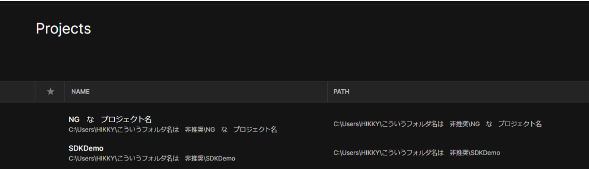

# SDK初学者：何か起きたときにとりあえず見るべきリスト

ワールド制作中に何かしらのトラブルが発生した際、問題の切り分けのために以下のチェックリストを確認すると早期の解決につながります。

## 環境構築・動作に関するトラブルシューティング

### Unityのバージョンを確認する

VketCloudSDKでのUnityの推奨バージョンは`Unity 2019.4.31f1`です。
バージョンが間違っている場合は動作が保証されないため、推奨バージョンでのプロジェクトの再作成が必要です。

Unityエディタの上部にバージョン記載があります。

### Unityプロジェクトとブラウザのキャッシュクリアを行う

ビルドの際にエラーが発生したり、ビルド後にワールドにて機能が動かない際は、Unityのキャッシュクリアやブラウザのキャッシュクリアを行うと改善される場合があります。

#### Unity側でのキャッシュクリア方法

SDKでは、ビルドしたワールドのデータをReleaseフォルダに格納しています。 
フォルダの中身は以下から確認できます。

Tools->Open Release Folderを選択

以下のようにReleaseフォルダがエクスプローラーにて開かれます。

このフォルダーに古いビルドデータが残っている際に、ワールドの誤動作の原因になる場合があります。 
VketCloudSDK --> Clear Cache を選択し、Releaseフォルダーの中身をリセットすると解消されます。

「リリースフォルダの中身を消しても大丈夫ですか？」という旨のウィンドウが出るため、問題がなければ「Accept」をクリックを押す。
これでキャッシュクリアは完了です。

#### ブラウザのキャッシュクリア方法（Chrome）

1. Google Chromeの画面右上の[︙]を押す。

2. [その他のツール]を選択後、[閲覧履歴を消去]をクリックする。

3. 「閲覧履歴データの削除」の[詳細設定]タブで「期間」リストの削除期間を選択する。

4. 「キャッシュされた画像とファイル」にチェックし、[データを削除]をクリックする。

!!! note caution
    ※削除対象の期間を全期間にすると確実に全てのキャッシュが削除されますが、VketCloudSDK以外のウェブサイトのキャッシュも削除されるためご注意ください。 
    ※お使いのブラウザによってキャッシュクリアの手順が異なるため、適宜ブラウザ側のヘルプをご参照ください。

## Unity側とブラウザ側でログインができているかを確認する

ワールドアップロードの際、ブラウザからVket Cloudのアカウントにログインしていない場合に不具合が発生する場合があります。 
Vket Cloud公式サイトにてマイページにログインし、Unityから再度アップロードを行うと症状が解決する場合があります。

VketCloudSDKでログインを行うには、VketIDの登録とは別としてVket Cloudでライセンスの新規登録を行う必要があります。 
下記のサイトでログインを行い、ライセンスの取得をお試しください。
[https://cloud.vket.com/](https://cloud.vket.com/)

ログイン済みの場合、VketCloudSDK --> Accountを選択するとログインしているユーザーとライセンスが表示されます。

もしログインしていない場合は、Unityプロジェクトを再起動した上で、ログインを行ってください。 
Unity起動時に以下のウィンドウが出現している場合は、ログインに成功しております。

環境によってはポップアップが正常に出現しなかったり、Firewallやセキュリティソフトの設定によって動作しない場合もあるため、その際はPCのセキュリティ設定をご確認ください。

## Unityとパソコンの再起動を試す

Unityやパソコンを再起動することで、改善されることがあります。 
特にSDKのバージョンアップ後や導入後に、再起動しないとスクリプトが起きなかったり、SDKのControl Panelが起動しない場合があります。

上記画像のような状況が発生した際はシーンを保存いただいた上で、Unityプロジェクトを再起動すると改善する場合があります。

## パスとファイル名に空白や日本語などの2バイト文字が含まれていないか確認する

VketCloudSDKでは、Unityの読み込み参照先のファイルやフォルダに日本語などの全角の2バイト文字が含まれている場合にエラーが発生します。 
必ず読み込み先のファイルやフォルダは半角英数字で作成してください。

Unityプロジェクト名とUnityプロジェクトが含まれているパス名も2バイト文字が入っているとエラーの原因になります。 
名前への2バイト文字の使用は基本的に非推奨となっております。 
※ Unityの初回設定時、VketcloudSDKへログインができない問題で２バイト文字が含まれている場合エラーになります。

## スクリプトや一部のオブジェクトをInspectorから非アクティブにしてビルド確認をする

Hierarchyにある、問題があると思われるオブジェクトやスクリプトを非アクティブにしてビルドを繰り返す事によって、問題箇所を特定することができます。

## プロジェクトの再作成と移植を行う

導入に何らかのミスや不具合が発生している可能性もあるため、１から導入し直すことで改善できることがあります。
１から導入し直す場合は、下記のリンクのアカウントの準備から順番に進めてください。

1. [アカウント準備](../AboutVketCloudSDK/SetupAccount.md)

2. [動作環境](../AboutVketCloudSDK/OperatingEnvironment.md)

3. [SDKの導入方法](../AboutVketCloudSDK/SetupSDK_external.md)

4. [SDKにログインする](../AboutVketCloudSDK/LoginSDK.md)

5. プロジェクト再作成後、HierarchyにVketCloud一式を追加を行い、床を設置して最小構成でビルドを行いテストする。

### 問題が発生したプロジェクトの一部を移植する

最小構成で動作を確認した後、問題のあったプロジェクトから一部のobjectを複製して移植することで、改善される場合があります。

【移植方法】

1. Unity下部のProjectのAssetなどで空いてるスペースで、`Show in Explorer`を押す

2. 移植に必要なファイルを探し出す

3. 新しいプロジェクトにコピーする

!!! note caution
    SDKの中身を移動させる際は、念のためにバックアップを取ることを**強く**おすすめいたします。

## Unityエディターの再インストールを行う

Unity Hubをご使用の場合、インストールタブを開き、該当のエディターバージョンの歯車アイコンを選択するとアンインストールが可能です。
Unityエディターを入れ直すことで、改善が見られる場合があります。

---

## ワールド制作時のトラブル

### Q. UnityにVketCloud導入後にVketCloudSDKからログインしようとすると白い画面が出てログインができない

- A. VketCloudのサイトで新規登録を行う

VketCloudSDKでログインを行うには、VketIDの登録とは別としてVket Cloudでライセンスの新規登録を行う必要があります。 
下記のサイトでログインを行い、ライセンスの取得をお試しください。
[https://cloud.vket.com/](https://cloud.vket.com/)

- A. [パスとファイル名に空白や日本語などの2バイト文字が含まれていないか確認する](#2)

VketCloudSDKでは、Unityの読み込み参照先のファイルやフォルダに日本語などの全角の2バイト文字が含まれている場合にエラーが発生します。 
必ず読み込み先のファイルやフォルダは半角英数字で作成してください。

### Q. 「ビルドと実行」をしてもワールド読み込みが進まない

- A. [Unityプロジェクトとブラウザのキャッシュクリアを行う](#unity_1)

- A. テクスチャがSDK仕様のフォーマットに収まっているかを確認する

テクスチャの制限でビルドエラーになることが多いため、必ず仕様をご確認ください。

- 大きさが2048x2048以下のpng

- ２の累乗サイズの正方形（2048x2048,1024x1024,512x512等）または2の累乗サイズの長方形

- ビット深度は24bitまたは32bit

- png換算で80MB以下

- 拡張子は小文字(.png)にする。”.PNG”になっているとサーバーアップロードでエラーが出ることがあります。

[VketCloudの仕様制限](../WorldMakingGuide/UnityGuidelines.md)

### Q. Unity側とワールド側でのライティングの見え方が異なる

- A. Unity導入時の動作環境のマニュアルに設定記載がございます。
Unity側とワールド側での見え方がデフォルトでは異なるため、Unity側で設定を行う必要があります。
詳細内容は下記のリンクをご確認ください。

[動作環境](../AboutVketCloudSDK/OperatingEnvironment.md)

---

## ワールドプレイ中のトラブル

### Q. 対応端末について

パソコン:

Chrome / Firefox / Safari / Edge等のWebブラウザが使用できるもの。

スマートフォン:

#### Apple iPhoneシリーズ

iPhone X以降

iPhone SE（第2世代）以降

#### Android

Android 11.0以降

RAM 8GB以上

Google Pixelなら Pixel 5以降

!!! note caution
    ※上記のスペックを満たす全ての機種の動作を保証するものではありません。 
    ※お使いの端末の使用状況や通信環境などによって正しく挙動しない場合がございますので予めご了承ください。

### Q. ワールドに入ったがマルチルームにならない

パソコンにマイクが内蔵されているか、マイクを接続する必要があります。 
Vket Cloudでマルチプレイを行う場合、ワールド入場時にブラウザにて「マイクを許可」を必ず有効にしてください。 
※マイク許可がされていない場合、VketCloudの仕様上マルチプレイはできません

### Q. MyVketでアバターアップロードをしたがVketCloudSDKで簡易アバターになってしまう

VketCloudSDKは、簡易アバターの設定が通常のワールド設定では5万ポリゴンに設定されております。 
簡易アバター設定を行う場合はワールド側で設定を行うか、もしくは自分のアバターのポリゴン数を下げる必要があります。 
※ アバター自体のポリゴン数を下げるにはBlender等の外部ツールで行う必要があります。

#### VketCloudSDKのポリゴン数設定方法

1. Hierarchyから[VketCloudSettings](../VketCloudSettings/Overview.md)を選択し、Setting Modeに`Advanced`を選択する

1. Hierarchyから[MyAvatarSettings](../VketCloudSettings/MyAvatarSettings.md)を選択する

1. `Polygon`の数字を調整する

## それでも解決できない場合

- Discordでサポートを受ける

VketCloud/MyVketコミュニティDiscordに参加し、問題を「#質問・要望・不具合報告」フォーラムに投稿するか、あるいは「📨｜inquiry-ticket」にてプライベートチャンネルを作成します。

[VketCloud/MyVketコミュニティDiscord](https://discord.com/invite/vsFDNTKdNZ)

- メールで問い合わせる

メールでのお問い合わせも受け付けております。
カテゴリ・内容・画像をなるべく詳細に記載するとより早期の解決につながります。

[問い合わせフォーム](https://www.hikky.co.jp/contact)
