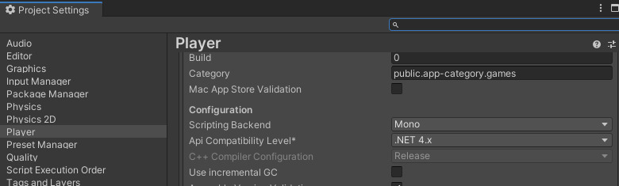

# SDK does not appear after install

If the Vket Cloud SDK does not boot after installing / show up on the tabs, there is high chance that the Deeplink package failed to be imported automatically. 
In such cases, the issue may be solved by manually importing the Deeplink package.

!!! warning "Note to macOS users"
    If you are using a macOS environment having Safari, Unity 2019, Unity 2022, or Unity 6 installed, this may cause an issue disabling [login to Vket Cloud SDK](../AboutVketCloudSDK/LoginSDK.md).  
    In such case, please uninstall Unity 2022 from the Unity Hub, restart the OS, and retry login.

## How to import the Deeplink package

1. Open the Unity Package Manager window via **Window-->Package Manager**.

    

2. Click the `+` button on the Package Manager, then click the `Add Package from git URL / name` button.

    

3. Copy the Deeplink URL on below:  
    `https://github.com/needle-tools/unity-deeplink.git?path=/package`

4. Paste the Deeplink URL on the URL box of the Package Manager, then click `Add`.

Completing the instructions above, the installation progress bar for the Deeplink package will appear. 
When the progress bar disappears, the Deeplink installation is completed.

After completing the installation, the information of Deeplink (e.g. current version) will appear on the Package Manager.

## "Vket Cloud SDK" Tab Not Appearing

Sometimes, the "Vket Cloud SDK" menu does not appear at the top of the Unity interface. Below are two common reasons why this might happen.

### Set the Api Compatibility Level to .NET 4.x

Check if the Api Compatibility Level in the Player settings (Project Settings → Player → Configuration) is not set to .NET 4.x. Update it to .NET 4.x.

If the tab still does not appear, try restarting Unity and then check the error console.

### Presence of VRChat-Related Assets

Conflicts often occur if Udon scripts, VRM conversion scripts, or UniGLTF scripts are present. Coexistence with VketCloud can be difficult. The quickest solution is to remove all script files (.cs). Keep in mind that when importing assets from VRC, scripts cannot be used with VketCloud.
