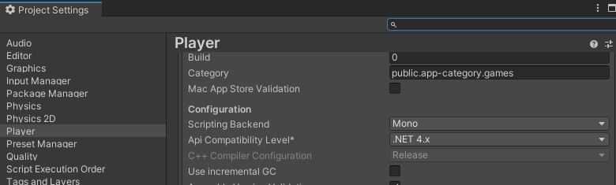

# SDKがインストール後に立ち上がらない

VketCloudSDKをインストール後に再起動しても立ち上がらない・VketCloudSDKタブが表示されない際は、Deeplinkパッケージが何らかの原因によって自動インポートされなかった可能性があります。 
手動でDeeplinkパッケージをインポートすることで解決する場合があります。

!!! warning "macOSをお使いの方へ"
    macOSとSafariを使用している環境において、Unity 2019とUnity 2022が同じ環境にインストールされている場合、[VketCloudSDKに正常にログインできない](../AboutVketCloudSDK/LoginSDK.md)事象が発生する場合がございます。  
    その場合、Unity HubからUnity 2022をアンインストールの上、OSを再起動の上、再度ログインをお試しください。

## Deeplinkパッケージの導入方法

1. **「Window→Package Manager」**でUnityのPackage Managerを開けます。

    

2. Package Managerの`+`ボタンをクリックして、次の`Add Package from git URL / name`ボタンをクリックします。

    

3. 以下のDeeplinkのURLをコピーします。 
    `https://github.com/needle-tools/unity-deeplink.git?path=/package`

4. Package ManagerのURLを入力する枠にDeeplinkのURLをペーストして、`Add`ボタンをクリックします。

上記の操作が完了すると、Deeplinkパッケージのインストール用のプログレスバーが表示されます。 プログレスバーが消えると、Deeplinkのインストールが完了したことになります。

インストールできたら、Package ManagerでDeeplinkのバージョンなどのインフォメーションが表示します。

## VketCloudSDKタブが表示されない

Unity上部に「VketCloudSDK」の表示がない状態になることがあります。
ここでは特に多い2パターンについて紹介します。

### Api Compatibility Levelを.NET 4.xにする

Project SettingsのPlayerのConfiguraitionのApi Compatibility Levelが.NET 4.xになっていない可能性があります。更新しましょう。

それでも表示されない場合、一度Unityを再起動し、エラーコンソールを確認してください。

### VRChat関連の資材が入っている

特にUdonスクリプトやVRM変換スクリプト、UniGLTFスクリプトあたりは誤作動を起こしやすいです。これらとVketCloudの共存は難しいので、スクリプト類(.cs)はすべて削除するのが一番早い解決方法となります。VRCから資材を移植する際は、スクリプトはVketCloudでは使用できないことを留意しておきましょう。
