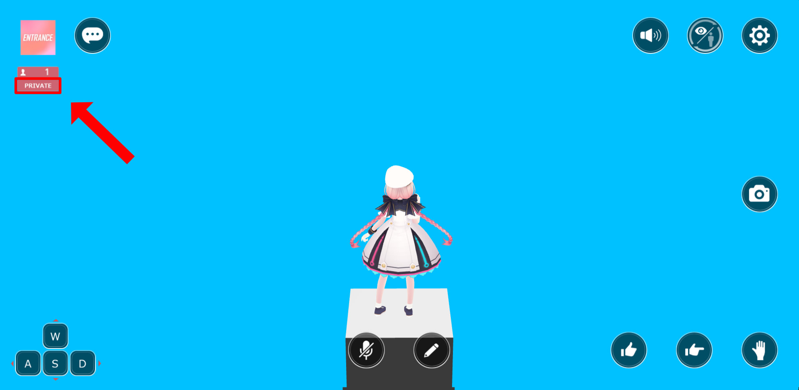

# The "private" indication dissapears on reloading the uploaded world check page

In the "check the world" page on the world management page, which accessible after uploading a world on the Vket Cloud website, the "private" indication on the top left disappears on reload.

Appearance on first enter:

Appearance on reload:

This issue does not affect the world's publication status, which handles the world's appearance on My Vket. 
Note that the private indication has been used for the now-discontinued private room feature, anybody may access the world regardless of public/private status if the world URL is revealed.