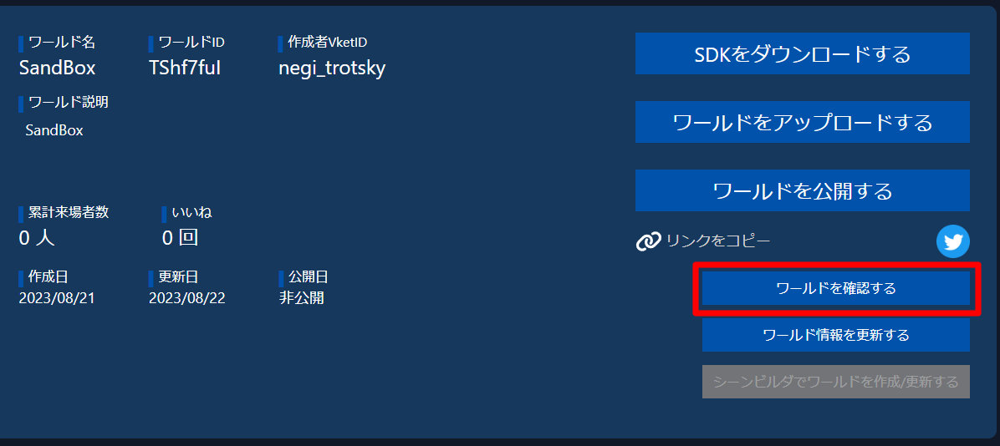

# アップロードしたワールドの確認時にリロードするとPrivateの表記が消える

Vket Cloudのウェブサイトにワールドをアップロードした上で、ワールド管理画面から「ワールドを確認する」を選択し、該当のワールドを読み込み終えた後にリロードすると画面左上の"Private"表記が消えます。

初回入場時：

リロード時：

この不具合の前後でワールドの公開状態は変更されないため、My Vketなどで自分のワールドが公開されることはありません。 
なお、本表記は現在は廃止されているプライベートルーム機能のものであり、公開/非公開に関わらずワールドのURLを公開すると誰でも入場が可能である点にご注意ください。