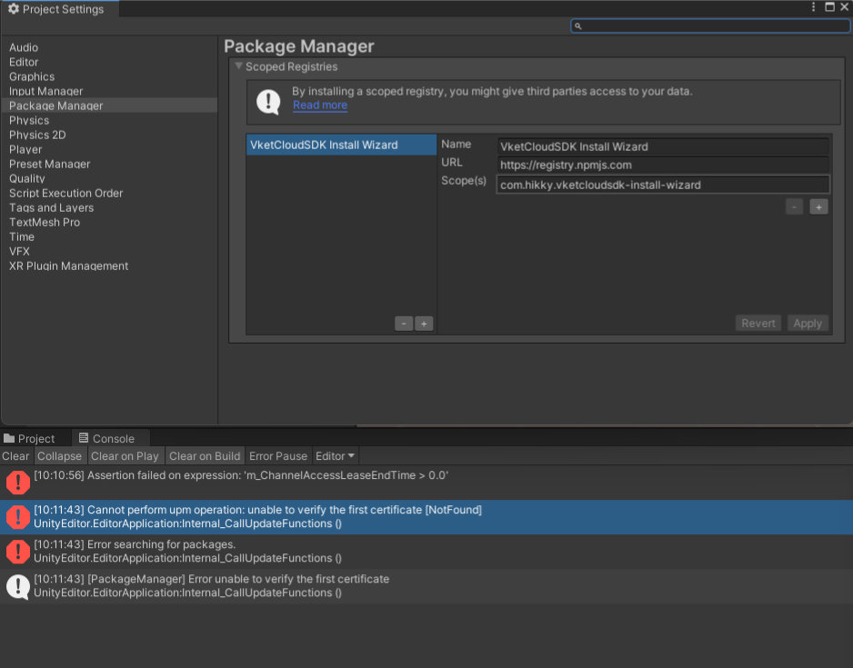
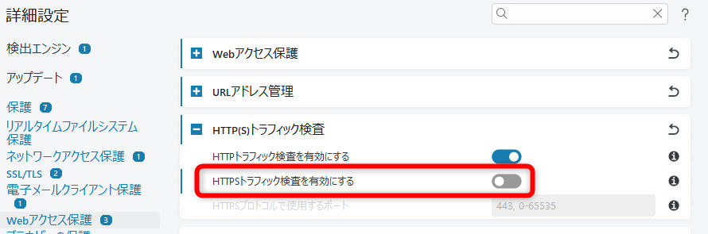

# Installation blocked by security software

お手元の環境によっては、VketCloudSDK Install Wizardを導入する際にUnity Package Managerの作動が差止められて以下の画像のようにエラーが表示される場合があります。

これはUnityのPackageManagerがアクセスしようとしているアドレスの中にドメインの証明書が切れているものがあり、それを原因としてセキュリティソフトが検知していることが原因です。

```
Cannot perform upm operation: unable to verify the first certificate [NotFound]
UnityEditor.EditorApplication:Internal_CallUpdateFunctions ()
```



## 対処方法

基本的には、ドメインの証明書更新をお待ち下さい。<br>
どうしても急ぎの場合、ユーザーの責任の元で、一次的に証明書の検査を無効にすることで、インストールが成功する可能性がございます。

ご使用のセキュリティソフトから、「HTTPSトラフィックの検査を行う」のような項目を無効にしていただくことで、セキュリティソフトで実施するドメイン証明書の検査が無効になり、差止めが行われなくなる可能性がございます。

!!! warning "インストールの完了後、必ず設定を元に戻す（HTTPSの検査を有効にする）ことを忘れないでください。"


