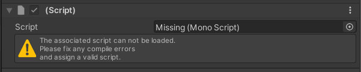

# Version Update Troubleshooting

This page lists troubles and solution that may happen when [updating the VketCloudSDK](../AboutVketCloudSDK/SetupSDK_external.md#installing-a-specified-version-updating-an-existing-sdk).

If a trouble not listed / cannot be solved by solutions on this page happens on version updating, feel free to ask on the [contact form](https://www.hikky.co.jp/contact?type=service&category=general){target=_blank} or the [Vket Cloud community Discord](https://discord.com/invite/vsFDNTKdNZ){target=_blank}.

## VketCloudSDK tab not showing on the top menu

After updating the VketCloudSDK, the VketCloudSDK tab may not be shown on the Unity editor's top menu as expected.


This can be solved by manually updating the required packages' version by the following procedure:

1. Select "Show in Explorer" through the right-click menu on the Project window, which will open the current project on the explorer.

    

2. Move to the Packages folder containing the Manifest.json file, and open Manifest.json.

    

3. Check if the VketCloudSDK and related packages are on the correct versions in Manifest.json. 
    For example, package versions must be as below for SDK Ver12.3.0:

    ```

    {
    "dependencies": {
    "com.hikky.editortutorialsystem": "1.0.1",
    "com.hikky.vketcloudsdk": "12.3.0",
    "com.needle.deeplink": "1.2.1",
    // etc

    ```

If the Deeplink package does not exist in the project, please try a [manual package import](../troubleshooting/InstallingDeeplink.md).

Also, if the EditorTutorialSystem does not exist, add the package below following the instructions of [SDK Install Manager](../AboutVketCloudSDK/SetupSDK_external.md#step-2-register-registry-information).

|  item  |  value  |
| ---- | ---- |
|  Name  |  EditorTutorialSystem  |
|  URL  |  https://registry.npmjs.org  |
|  Scope(s)  |  com.hikky.editortutorialsystem  |

## Missing Components After Version Update

After committing a [SDK version upgrade](../AboutVketCloudSDK/SetupSDK_external.md), the components created in the previous version may be shown as Missing.



The missing components will be usable by reattaching/fixing the values on the components.<br>
Taking a backup of the pre-updated world is **strongly** recommended for reattaching the components.

The components listed below may potentially be shown as missing:

- VKC Node Rotate Animation/HEOAnimation
- VKC Node Collider/HEOCollider
- VKC Node Cylinder Collider/HEOCylinderCollider
- HEOIblCubeMap
- VKC Node Blendshape Translator/HEOInfo
- VKC Node Mesh Collider/HEOMeshCollider
- VKC Node Mirror/HEOMirror
- VKC Node Reflection Probe Type/HEOObjectType
- HEO Reflection Probe
- VKC Node Shadow/HEOShadow
- VKC Node LOD Level/HEOLODLevel
- VKC Node UV Scroller/HEOUVScroller

!!! note caution
    When updating from Ver5.4 to Ver9.3, the HEOWorldSetting > Avatars > Avatar File settings may be missing, set the file by the procedure below on such occasion.

If the HEOWorldSetting > Avatars > Avatar File settings is empty, or has no contents, it may lead to build errors or no avatars displayed on default.<br>


As the SDK has a default avatarfile, select this file if there is an empty entry in the list after switching the version.


## Vket Cloud Settings are empty / Old settings from HEOWorldSetting and other components do not exist

On Ver12.3 and later versions, settings in [HEOWorldSetting](../VKCComponents/HEOWorldSetting.md), [HEOPlayer](../VKCComponents/HEOPlayer.md), and [HEODespawnHeight](../VKCComponents/HEODespawnHeight.md) have been migrated to
 [VketCloudSettings](../VketCloudSettings/Overview.md).

Although settings in the HEO components will be automatically migrated to VketCloudSettings, rare cases may occur causing settings to be empty as below:


This can be solved by resetting the settings values to default, by selecting the three-dot（…） button on the VketCloudSettings component, and selecting "Reset".

[VersionUpdateTroubleshooting_9](img/VersionUpdateTroubleshooting_9.jpg)

## Version Information Not Updated on Settings Window / HeliScript and Gimmick not working

After updating an existing project to Ver9.3, the version information on the bottom right of the settings window may remain to be the older version after build.


This can be solved by clearing the cache by VketCloudSDK > Clear Cache.


!!! note caution
    HeliScript/gimmicks may not work due to browser cache after version switching.<br>
    If such issue happens, try clearing the browser cache.


## File corruption error appears after updating SDK version

If an updated / non-existing script is attached on a project with an updated SDK, the message below may show up on opening the scene: 


If this issue appears, fix it by deleting the Library and Temp folder in the project folder and reboot the project. 

### How to Fix

1\. Close the Unity project if open.

2\. Open the Unity project with SDK on the explorer.<br>*This can be done by right-clicking the project on Unity Hub, and select "Show in Explorer"


3\. Delete the Library and Temp folder:


4\. Reopen the Unity project, and check if the error has been solved!
