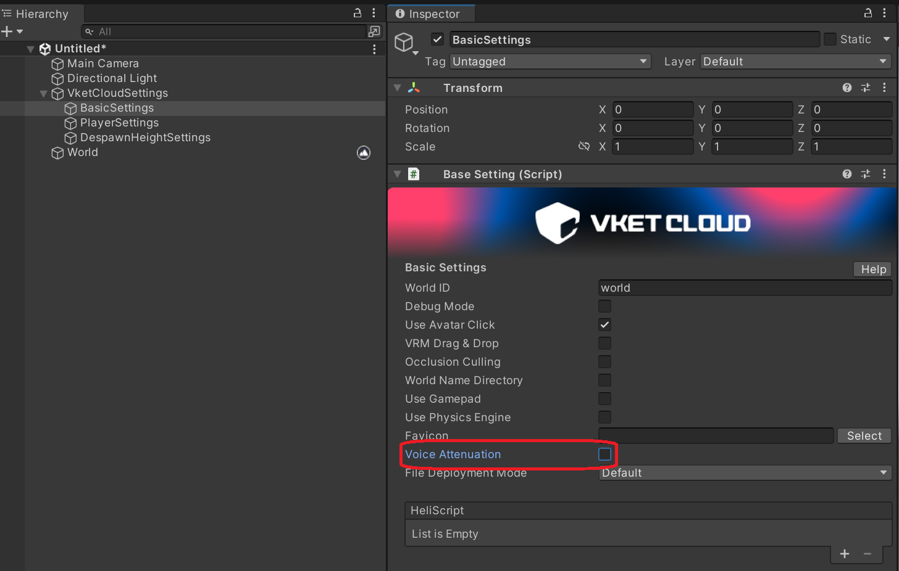
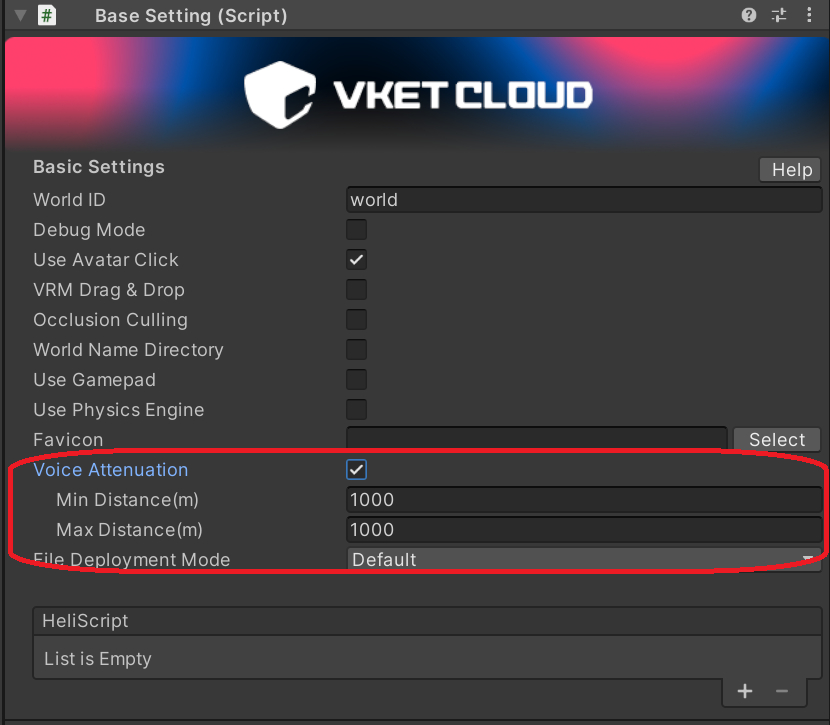

# Disabling the Voice Attenuation Option Causes the Entire Voice Chat Feature to Stop Working

!!! info "Test Environment"
    SDK Version: SDK14 or earlier 
    OS: Windows 11 
    Unity: 2022.3.6.f1 
    Browser: Google Chrome

## Issue

When the Voice Attenuation option is turned off, the voice chat itself becomes disabled.

## Solution

By setting the maximum movement distance for the world in the Voice Attenuation option, it is possible to configure it as effectively having no distance attenuation.

!!! info
    This issue is scheduled to be fixed. Until then, we apologize for the inconvenience and ask that you use the above workaround.
