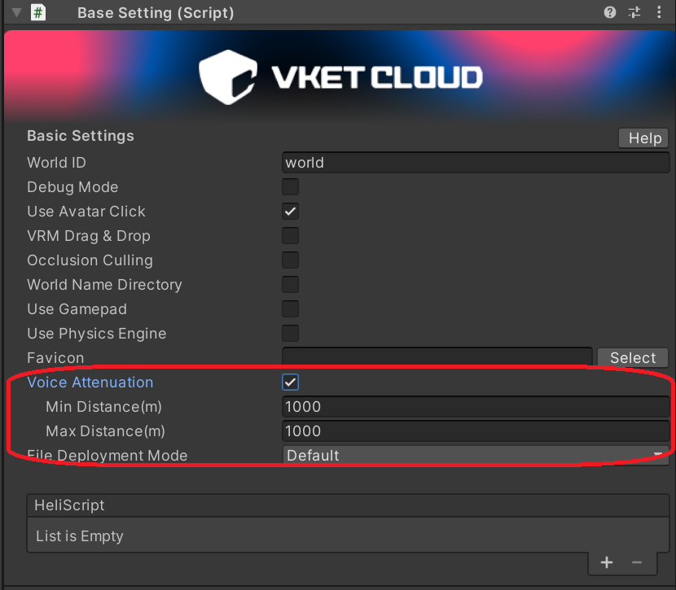

#音声減衰の項目をオフにすると、ボイチャ機能ごと動作しなくなる

!!! info "検証環境"
    SDKバージョン : SDK14系以前 
    OS : Windows 11 
    Unity : 2022.3.6.f1 
    ブラウザ : Google Chrome

## 現象

VoiceAttenuation(音声減衰)の項目をオフにするとボイチャ自体が無効状態になります。

## 解決方法

Voice Attenuationの項目をそのワールドの最大移動距離を設定することにより、実質距離減衰なしとして設定可能になります

!!! info 
    この不具合は修正予定となっております。それまでは申し訳ありませんが上記対応をお願いいたします。
